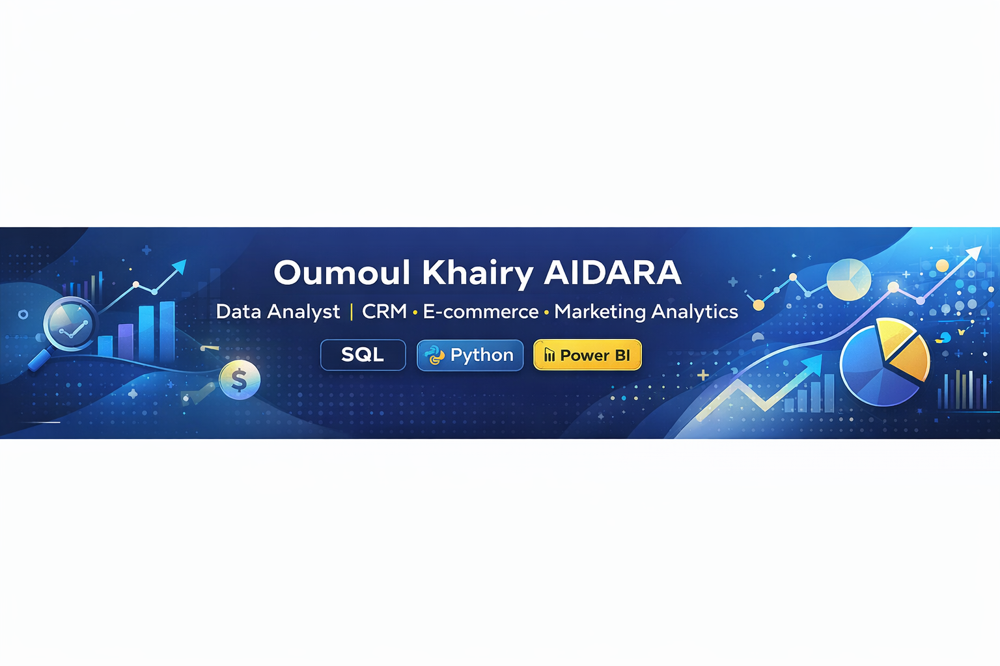

#  Bonjour, je suis **Oumoul Khairy AIDARA**

###  *Data Analyst spécialisée en Marketing, CRM & Retail Media*  
Passionnée par la donnée, le marketing digital et l’analyse du comportement consommateur, j’aide les entreprises à transformer leurs données en **insights actionnables** pour optimiser leurs performances (ventes, campagnes, CRM, satisfaction client…).

---

##  **Ce que je sais faire**
- **Analyse de données** : SQL, Python (Pandas, Seaborn, Matplotlib), Excel avancé  
- **Visualisation & Reporting** : Power BI, dashboards orientés business  
- **Marketing Analytics** : ROAS, ROI, segmentation, attribution, analyse de performance  
- **Retail Media & CRM** : campagnes, conversion, optimisation, comportement clients  
- **Nettoyage & préparation des données** : gestion des valeurs manquantes, outliers, typage, normalisation  

---

##  **Mes projets Data (GitHub Portfolio)**
### 🔹 [Projet 1 — Analyse des ventes par région & catégories (Excel Dashboard)](https://github.com/Oumoulk/data-portfolio/tree/main/ventes-par-region)
> KPI business · Dashboard interactif · Analyse Marketing & Retail · Excel

### 🔹 [Projet 2 — Analyse des performances des employés (Python)](https://github.com/Oumoulk/projet2-performance-employes)
> Statistiques · Visualisations · Outliers · RH Insights · Python, Pandas, Seaborn

*(D’autres projets arrivent : SQL, Power BI Sales Dashboard, Retail Media Analytics…)*

---

##  **Stack technique**
**Langages**  
`Python` · `SQL` · `DAX`

**Librairies Python**  
`Pandas` · `NumPy` · `Seaborn` · `Matplotlib`

**Outils Data**  
`Power BI` · `Excel` · `BigQuery` · `Google Cloud Storage`

**Domaines**  
`CRM` · `Retail Media` · `Marketing Analytics` · `E-commerce`

---

##  **Mon objectif actuel**
Décrocher un **CDI en Data Analyst Marketing / CRM / Business Analyst**, où je pourrai :

- apporter des analyses fiables & orientées business  
- construire des dashboards utiles aux équipes  
- améliorer la performance des campagnes marketing  
- contribuer à la stratégie data d’une entreprise  

---

##  **Me contacter**
📍 Paris, France  
🔗 LinkedIn : [oumoul-khairy-aidara](https://www.linkedin.com/in/oumoul-khairy-aidara)  
📧 Email : oumoul.khairy.aidara1@gmail.com  

---

✨ *Merci pour votre visite ! Explorez mes projets ci-dessus, et n'hésitez pas à me contacter pour collaborer ou en savoir plus.*  
